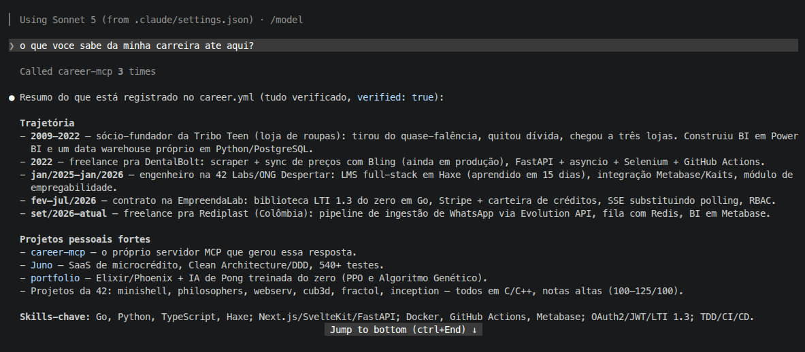

# career-mcp

**Um MCP que acompanha a sua carreira e mantém seus dados atualizados
enquanto você trabalha.**

Conte ao seu agente o que você entregou e ele registra na hora. Conecte o
GitHub e os projetos novos chegam como sugestão para você aprovar. Currículo,
LinkedIn e portfólio saem sempre da versão mais recente, e qualquer agente
conectado explica a sua trajetória sem inventar nada.

## O problema

Você constrói muita coisa e esquece metade. O projeto de dois anos atrás
resolveu um problema real, mas hoje você não lembra o número que mudou. O
LinkedIn diz uma data, o currículo diz outra e o portfólio nem cita aquele
repo. Na entrevista, quando pedem "me conta de um projeto difícil", a resposta
sai genérica.

O problema não é falta de experiência. É falta de registro.

<p align="center">
  
</p>

## O que ele faz por você

- **Registra enquanto você trabalha:** entregou algo, mudou de cargo, tirou
  uma certificação? Diga ao agente no meio da conversa e ele grava, com diff e
  commit.
- **Acompanha o GitHub por você:** repos e atividade viram sugestões de
  projetos, skills e experiências, que você só revisa e aprova.
- **Mantém os canais em dia:** LinkedIn, currículo e portfólio saem da mesma
  fonte, e o `diff_channels` aponta o que ficou desatualizado.
- **Prepara entrevistas:** cada projeto guarda `problem`, `solution` e
  `result`, e o agente monta a narrativa a partir disso, não da imaginação.
- **Adapta o currículo a uma vaga:** cruza os requisitos com o que você
  realmente fez.
- **Cobra o que falta:** a auditoria trimestral valida os dados e lista as
  pendências.

## Como funciona

### Uma fonte de verdade

`data/career.yml` é a única fonte de verdade. Tudo o mais é derivado e
descartável: `output/` se regenera, `cache/` se refaz com um sync. O histórico
vive num repositório Git dentro de `data/`.

### Nada entra sem procedência

Cada entidade carrega:

```yaml
provenance:
  verified: false          # false = sugestão; true = você conferiu
  source: manual           # manual | github | inferred
  source_ref: github:etovaz/career-mcp
  last_synced_at: 2026-09-12T11:00:00Z
```

### GitHub é evidência, não verdade

O GitHub nunca escreve `problem`, `solution`, `result` nem bullet de
experiência, porque ele não sabe disso. O que ele oferece vira proposta com
`verified: false` e só vira fato via `mark_verified`.

### Nenhuma escrita às cegas

Toda tool de escrita mostra o diff antes e só grava com `confirm: true`. Cada
gravação vira um commit no Git de `data/`, então `git log career.yml` é a
linha do tempo da sua carreira.

## Quickstart

```bash
npm install
cp .env.example .env          # preencha MCP_AUTH_TOKEN
npm run dev
```

Gere o token com `openssl rand -hex 32`.

Conecte o seu cliente MCP. No Claude Code:

```bash
claude mcp add --transport http career-mcp http://localhost:3000/mcp \
  --header "Authorization: Bearer SEU_TOKEN"
```

Em clientes configurados por JSON (Cursor, VS Code e afins), o formato
costuma ser:

```json
{
  "mcpServers": {
    "career-mcp": {
      "url": "http://localhost:3000/mcp",
      "headers": { "Authorization": "Bearer SEU_TOKEN" }
    }
  }
}
```

> **Compatibilidade:** a autenticação é por bearer token. Funciona em
> clientes MCP que aceitam header de autorização via Streamable HTTP. Clientes
> que exigem OAuth, como os conectores web de alguns assistentes, ainda não
> conectam.

Com o cliente conectado, rode o prompt `criar-perfil`. Ele coleta o básico e
cria o `career.yml`. Se preferir começar na mão, este é um `data/career.yml`
mínimo:

```yaml
profile:
  name: Seu Nome
  headline: Desenvolvedor Backend
experiences:
  - id: acme-2023
    company: Acme
    role: Backend Dev
    start: 01/03/2023          # DD/MM/YYYY, entre aspas se o YAML reclamar
```

Datas são sempre `DD/MM/YYYY` em string. `end` ausente ou `null` significa
cargo atual.

### Desenvolvimento

```bash
npm test            # 352 testes
npm run typecheck
npm run build       # tsup -> dist/server.js
npm start
```

## Referência

### Variáveis de ambiente

| var | default | para quê |
|---|---|---|
| `MCP_PORT` | `3000` | porta HTTP interna |
| `MCP_HOST` | `0.0.0.0` | precisa ser `0.0.0.0` em container |
| `MCP_AUTH_TOKEN` | — | **obrigatória**; bearer token de `/mcp` |
| `GITHUB_TOKEN` | — | PAT; só as tools de GitHub precisam |
| `GITHUB_API_URL` | api.github.com | só para GitHub Enterprise |
| `CAREER_DATA_DIR` | `/app/data` | canônico; também é o repo Git do histórico |
| `CAREER_OUTPUT_DIR` | `/app/output` | gerados |
| `CAREER_CACHE_DIR` | `/app/cache` | cache do GitHub |

O `.env` é lido nativamente pelo Node. No container ele não existe: as vars
são injetadas direto.

### Rotas

| rota | auth | o que faz |
|---|---|---|
| `POST /mcp` | bearer | JSON-RPC do MCP |
| `GET /mcp` | bearer | 405 — sem SSE, o servidor é stateless |
| `DELETE /mcp` | bearer | no-op |
| `GET /health` | isenta | healthcheck |

O token é comparado por SHA-256 com `timingSafeEqual`. O 401 é genérico e não
manda `WWW-Authenticate`.

### Resources

| uri | conteúdo |
|---|---|
| `career://profile` `experiences` `projects` `skills` `education` `certifications` `languages` | fatias do career.yml, já validadas |
| `github://repos` | último `sync_github` (cache) |
| `github://activity` | último relatório de atividade (cache) |
| `output://linkedin` `resume` `portfolio` | última geração |

### Tools

**Leitura** — `search_experiences`, `search_projects`, `search_skills`,
`validate_all`.

Busca ignora caixa e acento. `tech`/`stack` são AND: pedir dois traz só quem
tem os dois.

**Escrita** — `update_profile`, `add_experience`, `update_experience`, `delete_experience`,
`add_education`, `update_education`, `delete_education`,
`add_certification`, `update_certification`, `delete_certification`,
`add_language`, `update_language`, `delete_language`,
`add_project`, `update_project`, `delete_project`, `add_skill`,
`update_skill`, `mark_verified`.

Todas param no diff sem `confirm: true`. Com confirm, gravam e commitam no
Git de `data/`: título `<tool>: <path>`, corpo com cada mudança. Patch
substitui array inteiro, não mescla. Remover algo que uma skill cita como
evidência é recusado.

Se o `career.yml` tiver mudança não commitada — edição manual, por exemplo —,
ela entra num commit próprio (`Record changes made outside career-mcp`) antes
da escrita da tool. Só o `career.yml` é versionado; o `private.yml` nunca.

As `add_*` recebem lista (`experiences`, `education`, `certifications`,
`languages`, `projects`, `skills`) de 1 a 50 itens: uma escrita, um commit,
tudo ou nada.

`update_profile` é a única que cria o `career.yml` quando ele não existe
(exige `name` e `headline`) — é o primeiro passo num data dir vazio.

**GitHub** — `sync_github`, `import_github_repo`,
`suggest_skills_from_github`, `suggest_experience_from_activity`.

`sync_github` propõe repos que ainda não são projeto; os que já existem viram
`divergences[]`, sem proposta de escrita — o texto que você escreveu vale mais
que o metadado do repo. `import_github_repo` é o caminho explícito para
sobrescrever, mostrando antes o que muda.

**Geração** — `generate_linkedin`, `generate_resume`, `generate_portfolio`,
`diff_channels`, `tailor_for_job`.

Geração não pede confirm: `output/` é descartável. `diff_channels` marca cada
canal como `missing`, `stale` ou `current` — os três saem da mesma fonte,
então o que desencontra é arquivo gerado antes de uma edição.

### Prompts

- `criar-perfil` — guia inicial: coleta o profile e cria o `career.yml`
- `atualizar-linkedin-com-github` — sync, revisão, aprovação, geração
- `tailor-resume` (arg: `vaga`) — extrai requisitos, cruza com o career.yml
- `auditoria-trimestral` — valida, cobra o que falta, confirma pendências

## Self-host

Build pelo `Dockerfile` da raiz: multi-stage, runtime `node:25-alpine` com
`git`, usuário não-root, healthcheck em `/health`.

Storages a montar:

```
./data:/app/data
./output:/app/output
./cache:/app/cache
```

`data/` carrega o repo Git do histórico: é o único volume que precisa de
backup. Um `git remote add` + `git push` para um repo privado resolve.

Variáveis: `MCP_AUTH_TOKEN`, `GITHUB_TOKEN` e os `CAREER_*` se quiser mudar os
paths.

O app serve HTTP puro. TLS fica no reverse proxy — não configure TLS aqui.

### Exemplo: homelab com Coolify + Tailscale

É assim que o projeto roda em produção hoje:

- Deploy pelo Coolify, com as vars injetadas direto no container.
- TLS no Traefik do Coolify, com Let's Encrypt por DNS challenge no
  Cloudflare.
- Acesso só pela Tailscale; o domínio aponta para o IP da tailnet.

## Decisões de arquitetura

**YAML versionado em Git, sem banco.** O servidor é single-user e o volume é
de dezenas de entidades. Um arquivo dá diff e histórico de graça, é portável e
editável na mão, e não exige subir nenhum serviço extra.

**Stateless de verdade.** Cada `POST /mcp` cria um `McpServer` e um transport
novos e lê o YAML do disco. Reaproveitar instância entre transports
concorrentes causa colisão de request id.

**Diff por id, não por índice.** Remover a primeira de duas experiências por
índice reportaria "a primeira virou a segunda" e "a segunda sumiu" — descrição
falsa do que aconteceu. Entidades casam por `id` (ou `name`, em skills e
languages); reordenar vira `moved`. Arrays de string seguem por índice, que é
o certo para bullet.

**Write atômico.** `writeFile` em temp no mesmo diretório, `fsync`, `rename`.
Nunca existe um `career.yml` parcial em disco.

**Validação acontece no preview.** Se ela só rodasse no save, o preview diria
"ok" e o `confirm` estouraria depois.

**Testes batem em HTTP real.** O harness sobe o servidor numa porta efêmera e
conecta o client oficial do SDK; as tools de GitHub rodam contra um servidor
local que imita a API, com paginação por header `Link`. Sem mock de Octokit.

## Estrutura

```
src/
  server.ts              bootstrap
  config.ts              env -> Config (sem efeito colateral no import)
  http/                  app express, auth, transport
  mcp/
    resources/           career, github, output
    tools/               read, write, github, generators, tailor, validate
    prompts/             os quatro roteiros
    server.ts            factory do McpServer (uma por requisição)
  lib/
    schema.ts            Zod + integridade referencial
    loader.ts            load/save com write atômico
    history.ts           diff estrutural + commit no Git do data dir
    github.ts            wrapper Octokit
    coherence.ts         staleness dos canais
  templates/             linkedin, resume, portfolio
  test/                  harness MCP e GitHub falso
```

## Contribuindo

Toda contribuição começa por uma [issue](https://github.com/EvertonVaz/career-mcp/issues).
Bug, ideia de tool, melhoria na documentação: abra a issue antes de escrever
código.

1. **Abra uma issue** descrevendo o problema ou a proposta. Para bug, inclua
   como reproduzir e o que esperava acontecer. Para feature, conte o caso de
   uso — o porquê importa mais que o como.
2. **Espere o alinhamento na issue.** É ali que se decide se a mudança entra
   e qual o caminho. Isso evita trabalho perdido num PR que não encaixa no
   projeto.
3. **Envie a contribuição referenciando a issue** (`Closes #123` na descrição
   do PR).

O que se espera do PR:

- Teste primeiro: comportamento novo chega com teste, e os testes batem em
  HTTP real, sem mock de Octokit (veja [Decisões de arquitetura](#decisões-de-arquitetura)).
- `npm test` e `npm run typecheck` passando.
- Commits em inglês, no imperativo e concisos (`Add education write tools`).
- Escopo fechado no que a issue combinou.

Ao contribuir, você concorda que sua contribuição é licenciada sob a mesma
licença do projeto.

## Licença

[AGPL-3.0](LICENSE). Você pode usar, modificar e redistribuir, mas qualquer
versão modificada, inclusive oferecida como serviço pela rede, precisa ter o
código aberto sob a mesma licença.
